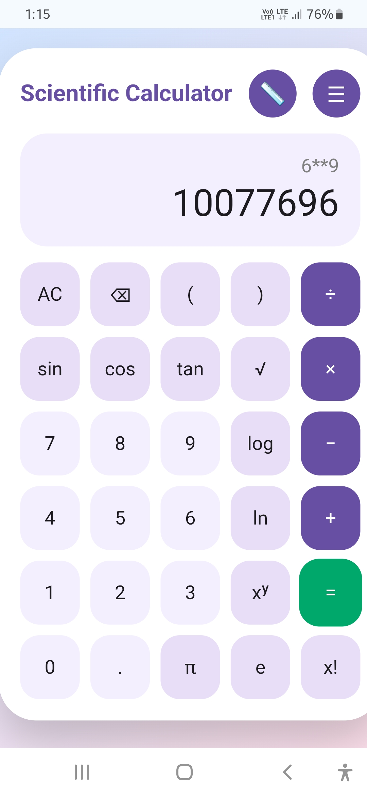
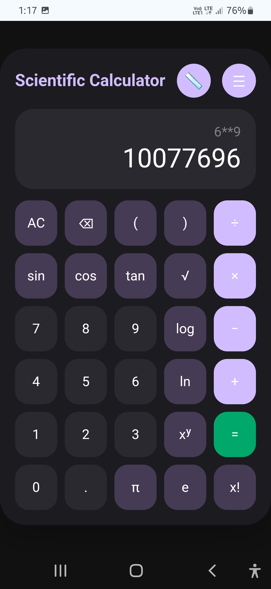
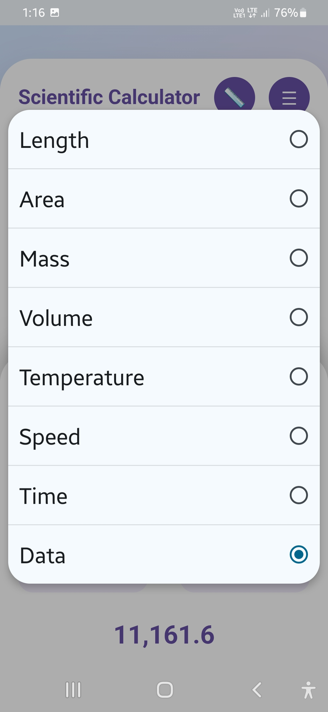
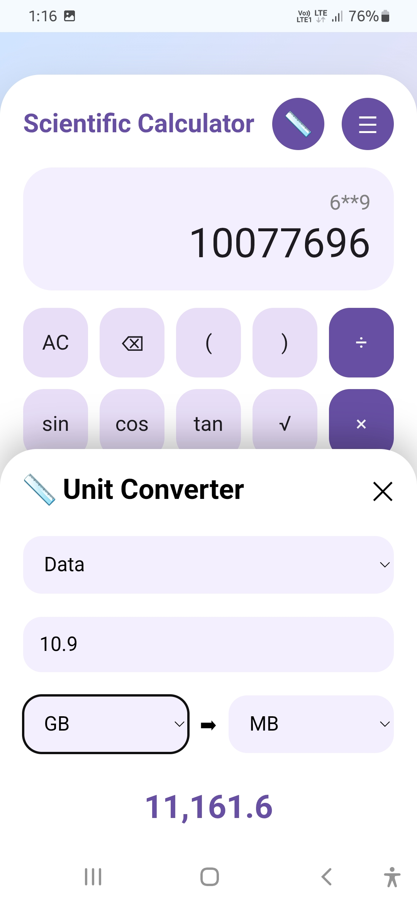

# 🧮 CalcuPress

 
 
 
 


## 🌐 **Live Demo:** https://divyanshkatiyar.github.io/Calcupress/

Modern **Material 3 Expressive Scientific Calculator & Unit Converter** built using **HTML, CSS, and JavaScript**.

---

<p align="left">
  
  
  
  
  
</p>

---

Calcupress combines an elegant **Material You**-inspired interface with powerful **scientific calculations** and an **all-in-one unit converter**, delivering a ⚡️ blazing-fast, lightweight, responsive, and user-friendly experience—all offline on any device 📥.

---

## ✨ Features

### 🧮 Scientific Calculator
- ➕ Basic arithmetic operations
- 📐 Trigonometric functions (sin, cos, tan)
- √ Square root
- 📈 Logarithm (log)
- 📊 Natural logarithm (ln)
- 🎯 Exponents (xʸ)
- ❗ Factorial
- π Pi constant
- e Euler's constant
- Parentheses support

### 📏 Unit Converter

- 📏 Length
- 🟩 Area
- 🌡️ Temperature
- 🧪 Volume
- ⚖️ Mass
- 🚗 Speed
- ⏱️ Time
- 💾 Data Storage

### 🎨 Material 3 Expressive UI
- 🌗 Light & Dark Theme
- 📱 Responsive Design
- 💫 Smooth Animations
- 🎯 Rounded Material Components
- ☰ Modern Menus 
- 🗑 Calculation History

---

## 🛠️ Tech Stack 

- HTML5
- CSS3
- JavaScript (Vanilla)

> No frameworks. No libraries. No dependencies.

---

## 📂 Project Structure

```
CalcuPress/
│
├── index.html
├── README.md
└── LICENSE
└── manifest.json
└── sw.js
```

---

## 🎯 Future Plans

- 📈 Graph Plotter
- 📊 Statistics Calculator
- 💱 Currency Converter
- 📅 Date Calculator
- 🧪 Programmer Mode
- 🧠 Equation Solver
- 📜 Calculation History
- ⌨️ Keyboard Shortcuts
- 🎙️ Voice Input

---

## 🤝 Contributing

Contributions, feature requests, and bug reports are always welcome!

If you'd like to improve CalcuPress, feel free to fork the repository and submit a pull request.

---

## 📄 License

This project is licensed under the **Apache 2.0** License.

---

## ⭐ Support

If you found this project useful, **consider giving it a ⭐** on GitHub to help the project reach more developers and motivates future improvements.

---
<div align ="center">
  
**Made with ❤️ using HTML, CSS & JavaScript.**
</div>
